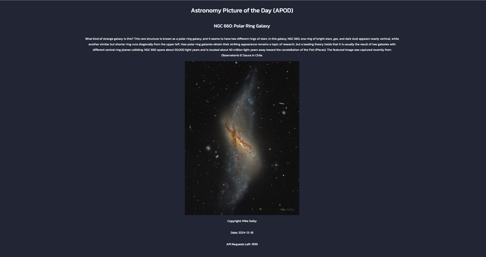

NASA APOD Viewer 🌌

This project uses NASA’s Astronomy Picture of the Day (APOD) API to display the daily space image or video, along with its description. It was built with Node.js, using Express for the server and EJS for dynamic rendering.

As someone who loves astrology and the mysteries of the universe, I chose this project to combine programming with my passion for space exploration. 🌠

🚀 Technologies
	•	Node.js and Express for the backend.
	•	EJS for rendering templates.
	•	Axios for HTTP requests.
	•	dotenv to manage environment variables.

🛠️ Setup
	1.	Clone the repository:
    git clone https://github.com/your-username/nasa-apod-viewer.git  
cd nasa-apod-viewer  
	2.	Install dependencies:
    npm install  
    3.	Create a .env file and add your NASA API key: 
    NASA_API_KEY=your_api_key  
    4.	Start the server:
    npm start  
    	5.	Open the site at http://localhost:3000/apod.

🌟 Features
	•	Displays NASA’s picture or video of the day.
	•	Allows users to view images from specific dates.
	•	Shows the remaining API request limit.

🖼️ Screenshot

